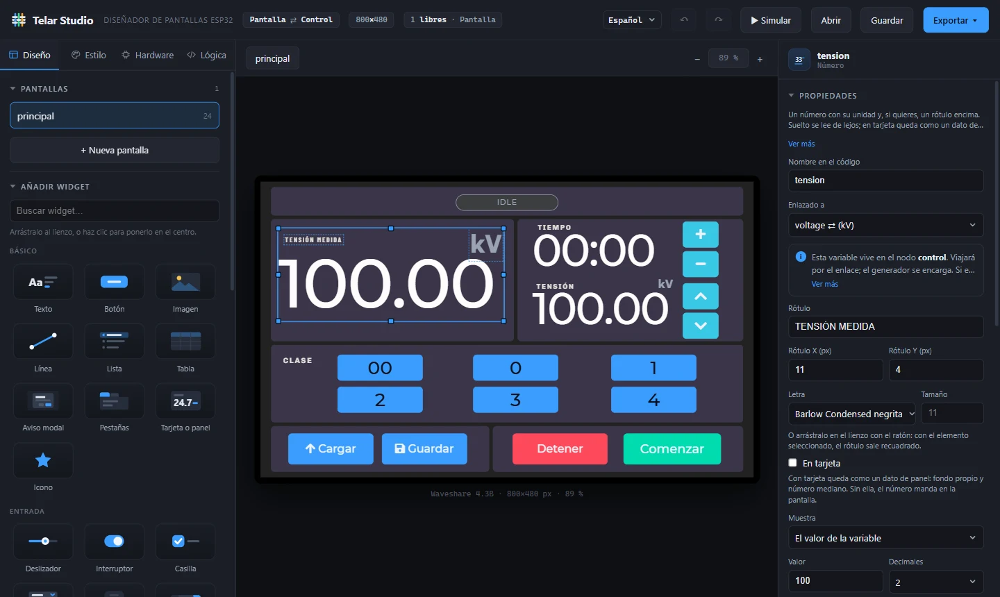
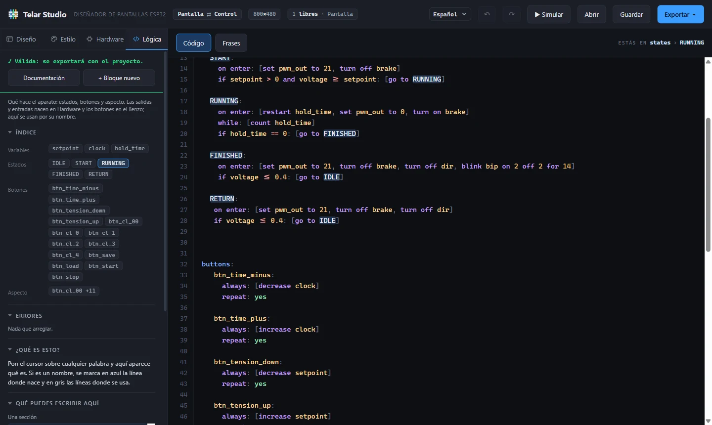
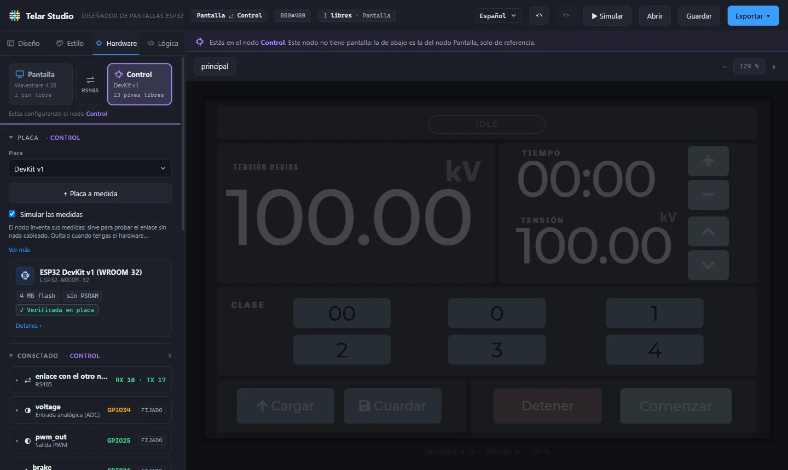
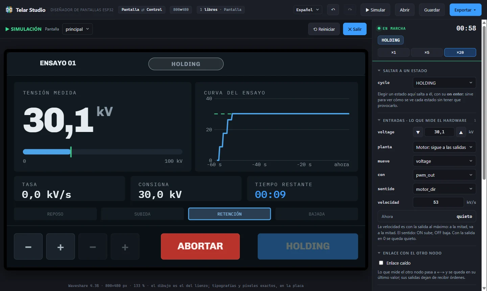
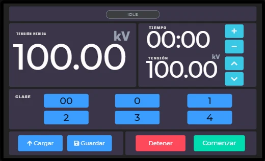
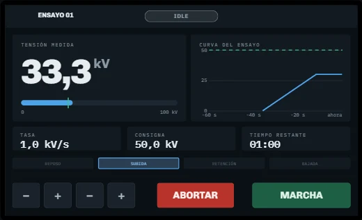
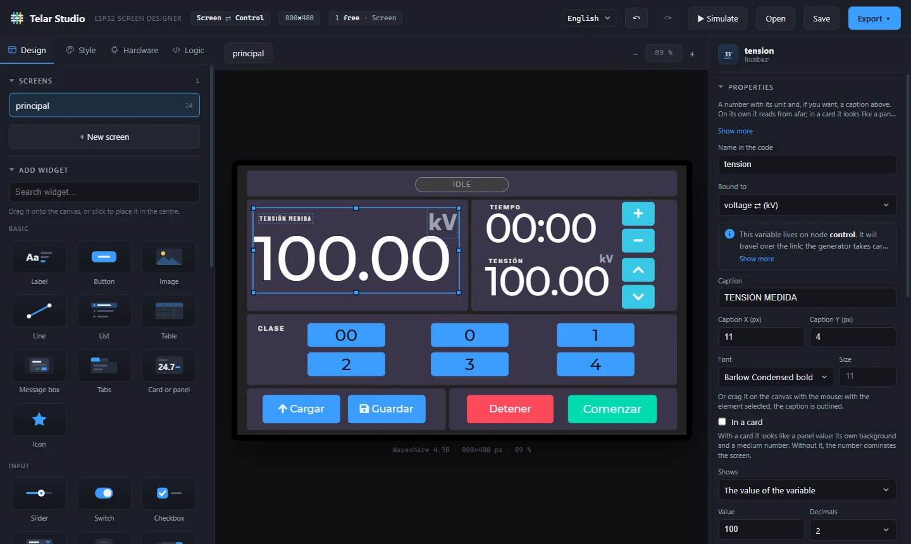
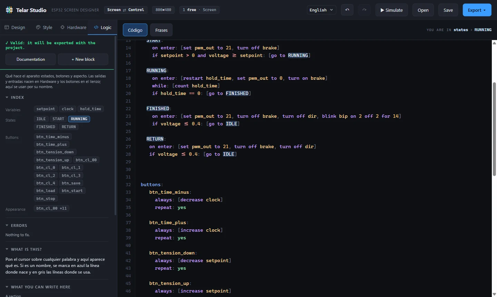
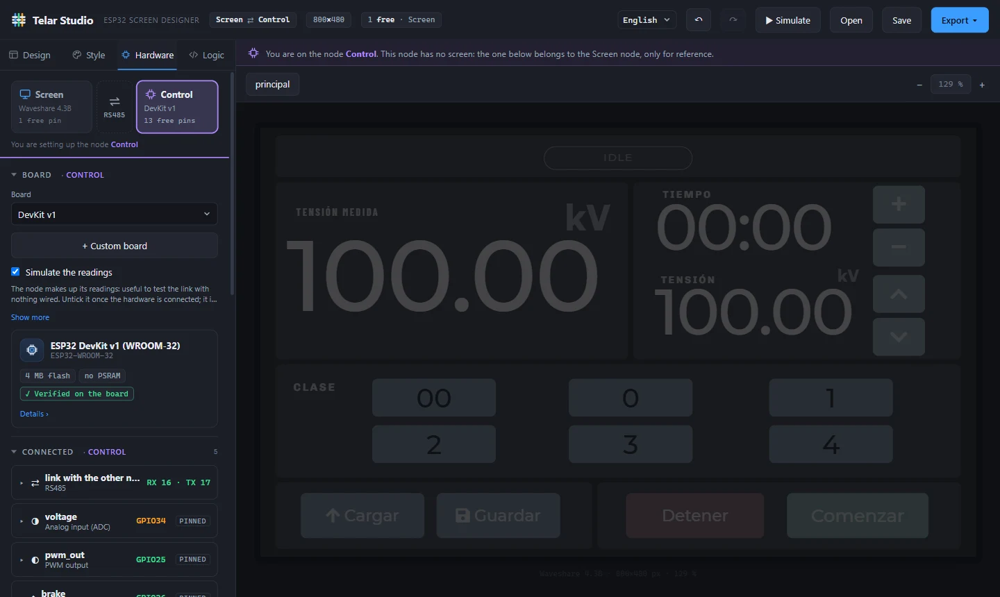
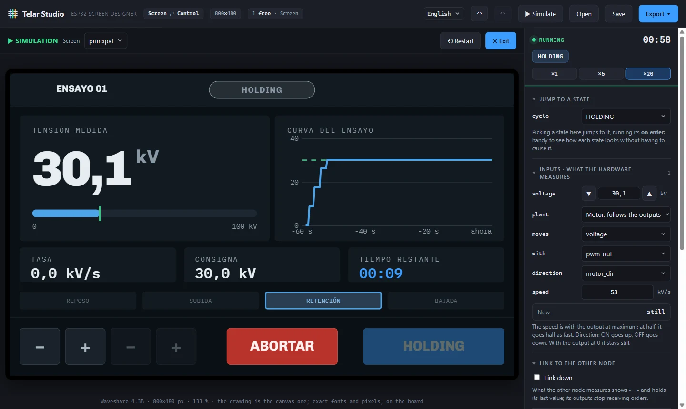

# Telar Studio

<b>🇪🇸 Español</b>

Plataforma para el desarrollo fácil y rápido de interfaces con LVGL.

Diseñas la pantalla arrastrando widgets, conectas sensores y salidas, escribes qué hace el aparato con un lenguaje sencillo y lo pruebas en el simulador. Al exportar, Telar escribe el proyecto completo, con sus fuentes ya generadas, listo para abrir y subir. La interfaz y la documentación están en español y en inglés.

### Descargar

La aplicación para Windows, macOS y Linux está en **[Releases](https://github.com/ailoviot/TelarStudio/releases)**. Todavía no está firmada: en Windows, si sale «Windows protegió su PC», *Más información* → *Ejecutar de todas formas*; en macOS, clic derecho → *Abrir*.

¿Sin instalar nada? Descarga el repositorio y abre `telar-studio.html` en Chrome o Edge.

### Placas

- **La pantalla:** placas ESP32 con pantalla integrada (Waveshare, Elecrow CrowPanel, CYD), un ESP32 con una TFT en color por SPI (ILI9341, ST7789, ST7735…) o una OLED por I2C (SSD1306, SH1106), o una Nextion/TJC por puerto serie.
- **El control, si hace falta:** cuando la pantalla se queda sin pines, un segundo nodo lee los sensores, mueve las salidas y le manda los datos. Puede ser otro ESP32, un Arduino UNO o Nano, una Raspberry Pi Pico… o una placa con Linux: **Raspberry Pi, Jetson Nano u Orange Pi**.
- **El enlace entre los dos:** **RS485** (lejos o con motores cerca), **UART** (menos de un metro), **CAN** (pensado para más de dos nodos) o **ESP-NOW**, sin cables. CAN y ESP-NOW, entre placas ESP32; los Arduino y las placas con Linux, por UART o RS485.
- **Lo que genera:** para los microcontroladores, el sketch de Arduino (`.ino`); para las placas con Linux, un programa de Python con su servicio de arranque.

### Así se ve

| Lógica | Hardware | Simulador |
|:---:|:---:|:---:|
|  |  |  |
| Qué hace el aparato, con índice y ayuda | Cada nodo, sus pines y el enlace | Se prueba todo sin compilar |

### Ejemplos

Descarga un `.telar.json` y ábrelo con el botón **Abrir**.

| | Ejemplo | Qué enseña |
|---|---|---|
|  | [control-var](ejemplos/control-var.telar.json) | El proyecto de referencia, probado en la placa: tensión y tiempo con − y +, clase de ensayo, guardar y cargar en memoria y dos nodos por RS485. |
|  | [variac_industrial](ejemplos/variac_industrial.telar.json) | Un ciclo de ensayo con estados (reposo, subida, retención con temporizador y bajada) y el tema Industrial: reloj de aguja, curva, consigna, pasos del proceso y pantalla de diagnóstico. |

### Para desarrolladores

| Carpeta o archivo | Qué es |
|---|---|
| `telar-studio.html` y los `.js` | La aplicación: diseño, estilo, hardware, lógica, simulador y generador de código |
| `docs/logica.html` | La documentación del lenguaje de lógica, con ejemplos |
| `lv-font-conv.js` | [lv_font_conv](https://github.com/lvgl/lv_font_conv) empaquetado para el navegador: genera las fuentes al exportar |
| `escritorio/` | La aplicación de escritorio (Electron) |

Para compilar la de escritorio, con [Node.js](https://nodejs.org) 22 o superior: `cd escritorio`, `npm install`, `node node_modules/electron/install.js` y `npm start` (o `npm run dist:win` para el instalador). Al subir una etiqueta de versión (`v1.2.0`), GitHub compila los tres instaladores y los publica en Releases.

**Licencia:** MIT. Las tipografías incluidas tienen la suya (SIL OFL o Apache 2.0), en `fuentes/`.

<b>🇬🇧 English</b>

A platform for building LVGL interfaces quickly and easily.

You design the screen by dragging widgets, connect sensors and outputs, describe what the device does in a simple language and try it in the simulator. On export, Telar writes the complete project, with its fonts already generated, ready to open and upload. The interface and the documentation are available in English and Spanish.

### Download

The app for Windows, macOS and Linux is on **[Releases](https://github.com/ailoviot/TelarStudio/releases)**. It is not signed yet: on Windows, if you see "Windows protected your PC", *More info* → *Run anyway*; on macOS, right-click → *Open*.

Rather not install anything? Download the repository and open `telar-studio.html` in Chrome or Edge.

### Boards

- **The screen:** ESP32 boards with a built-in display (Waveshare, Elecrow CrowPanel, CYD), an ESP32 with a colour TFT over SPI (ILI9341, ST7789, ST7735…) or an OLED over I2C (SSD1306, SH1106), or a Nextion/TJC over a serial port.
- **The control side, when needed:** when the screen runs out of pins, a second node reads the sensors, drives the outputs and sends the data. It can be another ESP32, an Arduino UNO or Nano, a Raspberry Pi Pico… or a Linux board: **Raspberry Pi, Jetson Nano or Orange Pi**.
- **The link between them:** **RS485** (long distances or motors nearby), **UART** (under one metre), **CAN** (meant for more than two nodes) or **ESP-NOW**, wireless. CAN and ESP-NOW between ESP32 boards; Arduino and Linux boards use UART or RS485.
- **What it generates:** for microcontrollers, the Arduino sketch (`.ino`); for Linux boards, a Python program with its startup service.

### What it looks like

| Logic | Hardware | Simulator |
|:---:|:---:|:---:|
|  |  |  |
| What the device does, with an index and help | Each node, its pins and the link | Try everything without compiling |

### Examples

Download a `.telar.json` and open it with the **Open** button. The projects are in Spanish.

| | Example | What it shows |
|---|---|---|
|  | [control-var](ejemplos/control-var.telar.json) | The reference project, tested on the board: voltage and time with − and +, test class, save and load to memory, and two nodes over RS485. |
|  | [variac_industrial](ejemplos/variac_industrial.telar.json) | A test cycle built with states (idle, ramp up, hold with a timer, ramp down) and the Industrial theme: needle gauge, curve, setpoint, process steps and a diagnostics screen. |

### For developers

| Folder or file | What it is |
|---|---|
| `telar-studio.html` and the `.js` files | The app: design, style, hardware, logic, simulator and code generator |
| `docs/logica.html` | Documentation of the logic language, with examples |
| `lv-font-conv.js` | [lv_font_conv](https://github.com/lvgl/lv_font_conv) bundled for the browser: generates the fonts on export |
| `escritorio/` | The desktop app (Electron) |

To build the desktop app, with [Node.js](https://nodejs.org) 22 or later: `cd escritorio`, `npm install`, `node node_modules/electron/install.js` and `npm start` (or `npm run dist:win` for the installer). Pushing a version tag (`v1.2.0`) makes GitHub build the three installers and publish them on Releases.

**License:** MIT. The bundled typefaces have their own (SIL OFL or Apache 2.0), in `fuentes/`.

